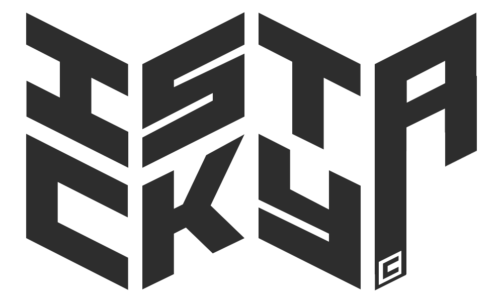

<a name="readme-top"></a>

<div align="center">

[![Contributors][contributors-shield]][contributors-url] [![Forks][forks-shield]][forks-url] [![Stargazers][stars-shield]][stars-url] [![Issues][issues-shield]][issues-url] [![MIT License][license-shield]][license-url] [![LinkedIn][linkedin-shield]][linkedin-url]

</div>

---

<!-- PROJECT LOGO -->
<br />
<div align="center">
  <a href="https://github.com/antoineedy/istacky">
    
  </a>

<h3 align="center">IStacky</h3>

  <p align="center">
    A lightweight image processing library
    <br />
    <a href="https://github.com/antoineedy/istacky"><strong>Explore the docs »</strong></a>
    <br />
    <br />
    <a href="https://github.com/antoineedy/istacky">View Demo</a>
    ·
    <a href="https://github.com/gantoineedy/istacky/issues">Report Bug</a>
    ·
    <a href="https://github.com/antoineedy/istacky/issues">Request Feature</a>
  </p>
</div>

---

## :books: About The Project

[![Usage of istacky][product-screenshot]](https://github.com/antoineedy/istacky/blob/main/design/gif1.gif)

<p align="right">(<a href="#readme-top">back to top</a>)</p>


## :technologist: Installation

__:arrow_heading_down: using pip__
```sh
pip install istacky
```

__:twisted_rightwards_arrows: by cloning the repo__

```sh
git clone https://github.com/antoineedy/istacky.git
cd istacky
pip install .
```

<p align="right">(<a href="#readme-top">back to top</a>)</p>


<!-- USAGE EXAMPLES -->
## :mag_right: Usage


__[Click here to access the documentation.](https://example.com)__
Here is the video tutorial of the library.


<p align="right">(<a href="#readme-top">back to top</a>)</p>


<!-- ROADMAP -->
## :world_map: Future of the project

I wonder if I (we?) should extend this project to create a Photoshop-like interface using the ipywidgets library. I really don't know any use to this project. Let me know if you have any ideas! See the [open issues](https://github.com/antoineedy/istacky/issues) for a full list of proposed features (and known issues).

<p align="right">(<a href="#readme-top">back to top</a>)</p>


<!-- CONTRIBUTING -->
## :family_man_woman_girl_boy: Contributing

Contributions are what make the open source community such an amazing place to learn, inspire, and create. Any contributions you make are **greatly appreciated**.

If you have a suggestion that would make this better, please fork the repo and create a pull request. You can also simply open an issue with the tag "enhancement".
Don't forget to give the project a star! Thanks again!

1. Fork the Project
2. Create your Feature Branch (`git checkout -b feature/AmazingFeature`)
3. Commit your Changes (`git commit -m 'Add some AmazingFeature'`)
4. Push to the Branch (`git push origin feature/AmazingFeature`)
5. Open a Pull Request

<p align="right">(<a href="#readme-top">back to top</a>)</p>


<!-- LICENSE -->
## :scroll: License

Distributed under the MIT License. See `LICENSE.txt` for more information.

<p align="right">(<a href="#readme-top">back to top</a>)</p>


<!-- CONTACT -->
## :dart: Contact

My name is Antoine EDY. Here is my [LinkedIn](https://www.linkedin.com/in/antoineedy/) and my [Github](https://github.com/antoineedy) profiles, and you can send me an email to [antoineedy@outlook.fr](mailto:antoineedy@outlook.fr).

<p align="right">(<a href="#readme-top">back to top</a>)</p>


<!-- MARKDOWN LINKS & IMAGES -->
<!-- https://www.markdownguide.org/basic-syntax/#reference-style-links -->
[contributors-shield]: https://img.shields.io/github/contributors/antoineedy/istacky?style=for-the-badge
[contributors-url]: https://github.com/antoineedy/istacky/graphs/contributors
[forks-shield]: https://img.shields.io/github/forks/antoineedy/istacky?style=for-the-badge
[forks-url]: https://github.com/antoineedy/istacky/network/members
[stars-shield]: https://img.shields.io/github/stars/antoineedy/istacky?style=for-the-badge
[stars-url]: https://github.com/antoineedy/istacky/stargazers
[issues-shield]: https://img.shields.io/github/issues/antoineedy/istacky?style=for-the-badge
[issues-url]: https://github.com/antoineedy/istacky/issues
[license-shield]: https://img.shields.io/github/license/antoineedy/istacky?style=for-the-badge
[license-url]: https://github.com/antoineedy/istacky/blob/master/LICENSE.txt
[linkedin-shield]: https://img.shields.io/badge/-LinkedIn-black.svg?style=for-the-badge&logo=linkedin&colorB=555
[linkedin-url]: https://linkedin.com/in/antoineedy
[product-screenshot]: design/gif1.gif